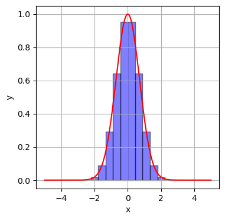

# 統計学基礎

## 確率変数

**確率変数**とは，とりうる各値に確率が与えられている変数のことである．
例えば，6面のサイコロの出る目は確率変数と考えられる．
確率変数の各値を取る確率を関数で表現したものを **確率分布** という．

## 期待値

**期待値** とは，確率変数を含む関数の実現値に確率の重みつき平均のことである．

確率変数 $X$ の実現値を $x$ として，確率分布を $p(x)$ ，確率変数 $X$ を含む関数を $\phi(x)$ とした時に，
期待値は次の式で計算できる．

$$
E[f(X)] = \int_{\infty}^{\infty}{ \phi(x) p(x) dx}
$$

つまり，期待値計算は積分計算に置き換えることができる．
プログラミング等を用いて期待値を計算する場合は，数値積分を行う．

### 期待値計算 -長方形による近似-
数値積分には複数の方法があるが，ここでは長方形を用いた方法を説明する．
これは，積分値，つまり，曲線 $y=f(x)$ と$x$ 軸との間の面積を，幅 $\Delta$ 高さ $f(x_i)$ の細かい長方形の和として近似する方法である．

数式では以下のように書ける．
ただし，各点$x_{i}$と$x_{i-1}$の間隔は等間隔であり，$x_{i} - x_{i-1} = \Delta$とする．

$$
\int_{\infty}^{\infty}{f(x)dx} \approx \sum_{i_{min}}^{i_{max}}{f(x_i)}\Delta
$$

精度を上げる為には， 

* 幅 $\Delta$ を小さくする，つまり $\Delta \rightarrow 0$ 
* 長方形を作る領域を広くする，つまり $x_{i_{min}} \rightarrow -\infty, x_{i_{max}} \rightarrow \infty$ 

とすればよい．

数値積分のイメージは下図である．ある1変数関数 $y = f(x)$ があった時に，下図のように長方形を区切って，長方形の和を積分値とする．

